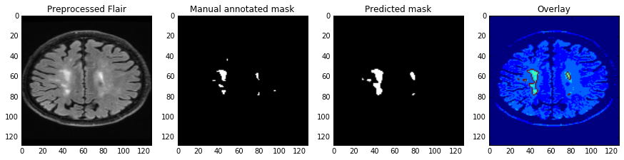
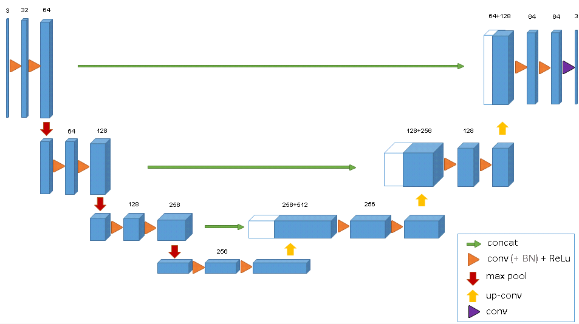
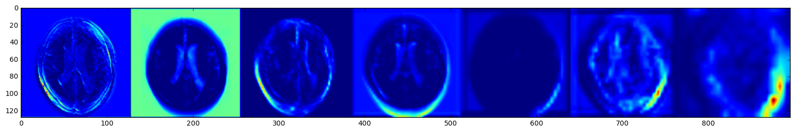
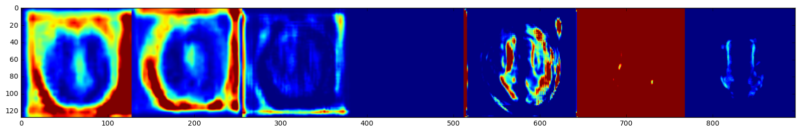

# Segmentation of white matter intensities using 3D U-net.

White Matter Hyperintensities (aka., leukoaraiosis) is often linked to high risk of stroke and dementia in older patients[1]. While image 
segmentation is critical for diagnosis and evaluation of treatments, automated segmentation of medical images remains a challenging task. In 
this post, a deep learning network called U-net is evaluated on brain MRIs for segmentation of White Matter Intensities (WMH).
The dataset was obtained from the [WMH Segmentation Challenge](http://wmh.isi.uu.nl/), which's organized by UMC Utrecht, VU Amsterdam, and NUHS Singapore. The goal is 
to train the deep learning model to generate binary mask that corresponds to WMH region of the brain MRI. 

### Why U-net
U-net was introduced by Olaf Ronneberger and his team back in 2015 as a refined autoencoder method targeting medical image segmentation [2]. Like an autoencoder, the contractive path (left side of the net) learns higher representations of the input, and the expansive path (right side) learns to generate new images (i.e, mask) by updating the weights of the convolutional layers through backpropagation. Upconvolution ([different from deconvolution](https://distill.pub/2016/deconv-checkerboard/)) is performed on the right side to generate higher resolution image from lower resolution feature maps. 
It's worth pointing out that while U-net looks very similar to SegNet (commonly used for semantic segmentation), the important difference is U-net's concatenation step, where high-resolution features in the contractive path is combined with more abstract  features in the expansive path.This allows the network to learn localized finer features without losing contextual information, making it a desirable tool for images with
high dynamic range and high resolution.

For this project,a modified U-net was compiled to accomodate 3D image arrays and computation cost, and this particular model is primarily based on Cicek et al.'s
published work on volumetric segmentation[3]. Instead of using the Caffe framwork, this model is built and trained using Keras. 

<b>Fig 1.</b> 4-layer U-net for volumetric segmentation.(<i>source:https://lmb.informatik.uni-freiburg.de/Publications/2016/CABR16/</i>)

### Data Processing

There was total of 60 patient samples (20 from each site), and different MRI parameters were applied at different hospitals to generate multiple images for each patient. The images of interest are the pre-processed files that corrected for bias field, and only the flair images are used. In the data_process.py script, it imports the image files and subsequently reformats the data into numpy arrays. The input to the U-net model is resized to samples of 128x128x16x1 tensor. The mask files in the training dataset were annotated manually by experts using the flair MRIs. In order to generate a bigger collection, image augmentation by affine transformation was used in the data processing step. In the end, there was total of 240 images. Due to large computational overhead,no batch normalization was used.

### Results

[Dice coefficient](https://www.omicsonline.org/JCSBimages/JCSB-07-209-g003.html) is used as a similarity metric to evaluate how much the predicted mask overlaps with the annotated/true mask and how robust it is. The use of kernels(3x3x1) that focus on the x-y plane and image augmentation significantly reduced overfitting. For a baseline model without augmentation, the Dice Coefficient for all validation image arrays was 73%. After data augmentation and training on more images, the total Dice Coefficient on the validation set(54 un-augmented images) was 79%, with average of 72%±12%. Given that there're computational constraints within the GPU instance, the images had to be resized and only parts of the slices were used. The model architecture can be further improved with more memory to handle additional image augmentation, more slices, and more channel for the T1 MRI.

I was curious to see how the trained model 'sees' the input, so I pulled out the post-activation feature maps from the convolution layers. From left to right on the top of Fig 3, it shows the representations as the model encodes and compresses the features (hence more blurry at the end). As for the bottom row, the drastic color changes indicate that there's some major learning/weight updating going on as the model is trying to compile a good mask image.

<b>Fig 2.</b> Activation maps from convolution layers. The top row corresponds to the contractive path, and the bottom row corresponds to the expansive/synthesis path. Few of the pictures were generated from low-intensity pixel distribution, so only one color is visble due to the collage displayed on global scale. 

#### REFERENCE
1. Wardlaw, J. M., Valdés Hernández, M. C., & Muñoz-Maniega, S. (2015). What are White Matter Hyperintensities Made of?: Relevance to Vascular Cognitive Impairment. Journal of the American Heart Association: Cardiovascular and Cerebrovascular Disease, 4(6), e001140. http://doi.org/10.1161/JAHA.114.0011402.
2. Ronneberger,O.,Fischer, F., Brox, T. (2015) **U-Net: Convolutional Networks for Biomedical Image Segmentation**. Medical Image Computing and Computer-Assisted Intervention (MICCAI), Springer, LNCS, Vol.9351: 234--241, 2015 
3. Çiçek, O.,Abdulkadir, A., Lienkamp, S., Brox, T., Ronnebergeer, O.  **3D U-Net: Learning Dense VolumetricSegmentation from Sparse Annotation**. Medical Image Computing and Computer-Assisted Intervention (MICCAI), Springer, LNCS, Vol.9901: 424--432, Oct 2016
